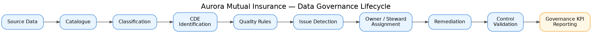

# Aurora Mutual Insurance

**A fictional UK insurer, built end-to-end to demonstrate Microsoft Fabric and
Microsoft Purview data governance skills.**

**What I demonstrated:** Microsoft Fabric · Microsoft Purview · Data Quality
· Metadata Management · Data Catalogue · Business Glossary · Critical Data
Elements (CDE) Management · Data Issue Management · RBAC · Dynamic Data
Masking · Power BI Governance · SQL · PySpark

📄 [Read the full case study](./case-study.md) — what got built, what went
wrong along the way, and what it taught me.

---

## The problem, in one paragraph

Most data governance portfolios are either pure documentation (a glossary and
some policy PDFs with no real data behind them) or a tutorial someone else's
dataset walked me through. Neither really shows what the job is like: judging
systems you didn't build, using tools that don't always cooperate, in
organisations where you don't control every permission. So I built a complete
insurance data platform from raw SQL through to a governed, catalogued,
quality-scored Fabric/Purview implementation, with a Power BI layer reporting
on top. Independently. Including the parts that went wrong.

## Architecture

Azure SQL Database → Fabric Lakehouse (bronze → silver → gold) → Power BI
semantic model → Purview governance layer (catalogue, glossary,
classification, data quality, CDE and issue registers).

## How the governance actually works, end to end

Every stage above is a real, working part of this project, not a slide. Source
data lands in the Fabric Lakehouse and gets scanned into Purview's catalogue.
Fields get classified for sensitivity, the ones that matter most get flagged
as Critical Data Elements, quality rules run against them, failures become
tracked issues with a named owner and steward, remediation happens where a
clear low-risk fix exists, controls get validated (the RBAC/masking work is
tested with three separately-authenticated logins, not assumed correct), and
the whole thing rolls up into a Governance KPI dashboard.

## Key outcomes

- 6 deliberately-planted data quality issues, detected by Purview with results
  matching the design exactly (39 malformed postcodes, 5 illogical dates, 158
  casing variants - all exact matches)
- A genuine multi-hour Fabric/Purview permission diagnosis, resolved through
  correct root-cause reasoning rather than trial and error -[full story
  here](./case-study.md#where-it-actually-got-hard)
- Two relationship bugs in the Power BI model found by checking every chart
  against a number I already knew, not by trusting a chart that rendered
  without error
- RBAC and Dynamic Data Masking implemented and validated with three
  genuinely separate, independently authenticated SQL logins
- A Critical Data Elements register, a full issue lifecycle register, and a
  Governance KPI dashboard, all on real queryable Fabric tables — with one
  proposed metric dropped rather than faked from a single data point
- Limitations documented on purpose: a 143% Loss Ratio, a couple of lineage
  gaps, a missing DAX measure - named clearly, not hidden

---

## What's in each folder

| Folder | What's there |
|---|---|
| `phase-0-company-brief/` | The fictional company profile, org chart, ownership model |
| `phase-1-data-design/` | Schema design, ER diagram, DDL, the synthetic data generator, full sample data |
| `phase-2-fabric-pipeline/` | The medallion pipeline, documented including what broke |
| `phase-3-purview-governance/` | Business glossary, GDPR classification, data quality rules and scorecard |
| `phase-4-power-bi/` | The governed semantic model docs, DAX measures |
| `phase-5-governance-docs/` | Governance policy, RACI matrix, CDE register, issue register, coverage facts, RBAC/masking implementation |
| `case-study.md` | The full write-up |

## Stack

Azure SQL Database · Microsoft Fabric (Lakehouse, Data Factory pipelines,
PySpark notebooks) · Microsoft Purview (Unified Catalog, Data Map, Data
Quality) · Power BI (governed semantic model, DAX) · Python (Faker, pandas) ·
T-SQL

## About

Built by Skelly Tagbajumi as a portfolio project targeting Data Management Analyst | Data Governance Analyst | Data Quality Analyst | Data Management Specialist | Metadata Analyst